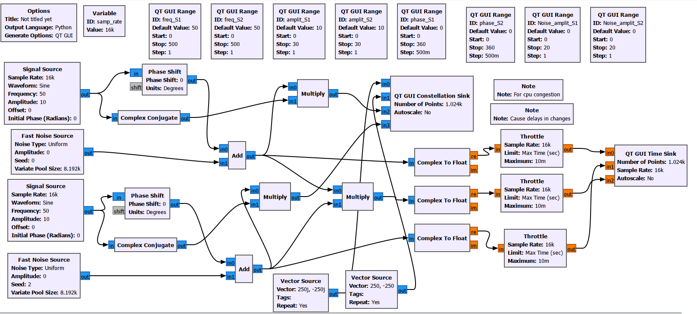

# ECSE 351 GNU Radio Phase Lab

## Description
This project uses the GNU radio software and is based on the ecse 351 phase lab. What it essentially does is it allows the manipulation of the
phase, frequency, and amplitude of signals 1 and 2 in order to see the change in the product of those two signals. It shows graphs of
the three signals and their constellations of phase shift. I have included the ability to add noise through changing the noise amplitude.

## Getting Started

# Dependencies
* Windows, Linux, macOS

### Installation
* Here is the [documentation](https://wiki.gnuradio.org/index.php/InstallingGR) to install GNU radio

### Executing Program
* Open the .grc file in GNU radio software
* When opened, it should appear as this:

* There should be a start button in toolbar at the top bar, click it and should get something like this:

## Help
GNU radio [documentation](https://wiki.gnuradio.org/index.php?title=Category:Block_Docs)
